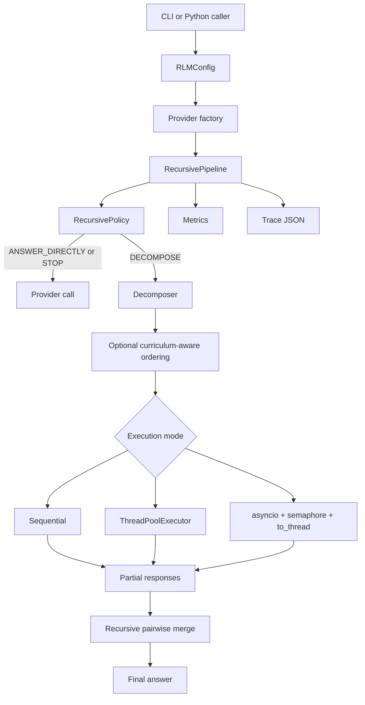

# Efficient RLM Architecture

## Problem Statement

Efficient RLM studies recursive language-model inference as an orchestration problem. A large summarization or synthesis task can be decomposed into bounded subproblems, executed with a chosen concurrency strategy, and merged into a final answer while preserving metrics and execution traces.

The project does not train model parameters and does not implement curriculum learning in the model-training sense. Its curriculum component is inference-time scheduling: simpler or shorter subproblems can be ordered earlier, and an optional coarse-to-detailed run can produce a coarse summary before recursive refinement.

## Runtime Flow

## Recursive Controller

`RecursivePipeline` is the main controller. It owns:

- the configured `LLMClient`
- a `Decomposer`
- a `RecursivePolicy`
- optional `CurriculumScheduler`
- run-local `Metrics`
- optional `TraceRecorder`

Each node records task depth, asks the policy whether to answer directly or decompose, and enforces deterministic safety limits before provider calls. Recursive aggregation uses pairwise merge prompts until one summary remains.

Only summarization is implemented as a first-class task type. Other task types would require task-specific prompts, decomposers, and evaluators.

## Decomposers

`FixedChunkDecomposer` splits text into deterministic word chunks. It is the default because it is reproducible, cheap, and safe.

`SemanticDecomposer` asks the configured provider for structured JSON subproblems. It parses IDs, prompts, context slices, difficulty estimates, and dependency IDs. Malformed provider output falls back to fixed chunking by default. Dependencies are validated and respected by the executor when present.

Dependency validation rejects:

- duplicate task IDs
- self-dependencies
- missing dependency IDs
- cycles

Tasks with no dependencies run as one independent wave. Tasks with dependencies run in deterministic waves where ready tasks may execute concurrently and dependent tasks wait for prerequisites.

## Policies

`DeterministicPolicy` preserves reproducible behavior. It decomposes when input size exceeds configured thresholds and hard limits permit further recursion.

`AdaptivePolicy` considers the same hard limits plus remaining call budget and a coarse complexity estimate based on word count. It is heuristic, not learned. It never overrides `max_depth`, `max_calls`, wall-clock limits, or token budgets.

## Execution Engines

The executor supports three runtime modes:

- `sequential`: executes subtasks one at a time.
- `threaded`: uses `ThreadPoolExecutor` for independent subtasks.
- `async`: uses `asyncio`, a bounded semaphore, timeout handling, retries, backoff, cancellation cleanup, and `asyncio.to_thread` for synchronous provider calls.

The current HTTP provider uses synchronous `urllib`. Async mode does not call this blocking I/O directly in the event loop; it delegates provider calls to worker threads with `asyncio.to_thread`. This provides real concurrency for independent network-bound calls while avoiding a new async HTTP dependency.

Results are returned in deterministic original task order even when tasks finish out of order.

## Provider Abstraction

Providers implement `LLMClient.generate_response(prompt) -> LLMResponse`.

`LLMResponse` normalizes:

- text
- provider
- model
- latency
- prompt tokens
- completion tokens
- total tokens
- finish reason
- request ID
- retry count
- raw provider response

The mock provider is deterministic and requires no network access. Ollama is optional and uses the local generate endpoint. OpenAI-compatible providers require an endpoint and credentials from an environment variable; credentials are not hard-coded.

## Budgets

Supported budgets include:

- maximum model calls
- maximum recursion depth
- maximum wall-clock seconds
- maximum prompt tokens
- maximum completion tokens
- maximum total tokens

Call count and estimated prompt tokens are reserved before a request starts. This prevents concurrent workers from all passing a stale pre-flight budget check. Completion tokens and provider-reported actual usage are only known after a request finishes, so in-flight requests may create bounded overshoot for completion-token and actual-total-token limits.

## Tracing

When enabled, tracing records a JSON tree for each run. Each node includes:

- node ID and parent ID
- depth
- task preview
- status
- start/end time and latency
- provider/model metadata
- token counts when available
- decomposition and aggregation markers
- child IDs
- stopping reason
- errors
- output preview

Traces can be rendered as a text tree, Mermaid graph, or self-contained static HTML.

## Failure Handling

Provider failures are surfaced to the caller. The executor wraps worker failures in `ExecutionError` so threaded and async execution modes have a consistent error surface. Async execution cancels pending tasks after a worker failure and waits for cleanup before re-raising.

Budget stops are marked in metrics with an explicit reason. In threaded and async child execution, budget exceptions may be wrapped by the executor because they occur inside worker tasks.

## Design Tradeoffs

- Fixed decomposition remains the default because it is deterministic and does not spend model calls deciding the decomposition.
- Semantic decomposition is optional because it depends on model output quality and can consume budget before answering.
- Async mode uses `to_thread` instead of a native async HTTP client to keep dependencies minimal while preserving non-blocking event-loop behavior.
- Deterministic reference metrics are intentionally simple. They are useful for regression and synthetic tasks but are not a complete measure of answer quality.
- The benchmark suite is small and synthetic so it can run locally and in CI without external datasets.

## Known Limitations

- The core task type is summarization/synthesis, not arbitrary agentic problem solving.
- Semantic decomposition is only as reliable as the provider's structured output.
- Token counts are exact only when providers return them; otherwise the project uses word-based estimates.
- Completion-token and actual-total-token budgets can only be checked after in-flight requests return.
- LLM-as-judge evaluation is optional and should not be interpreted as objective ground truth.
- Real latency improvements depend on model/provider behavior, rate limits, hardware, and whether subtasks are actually independent.
